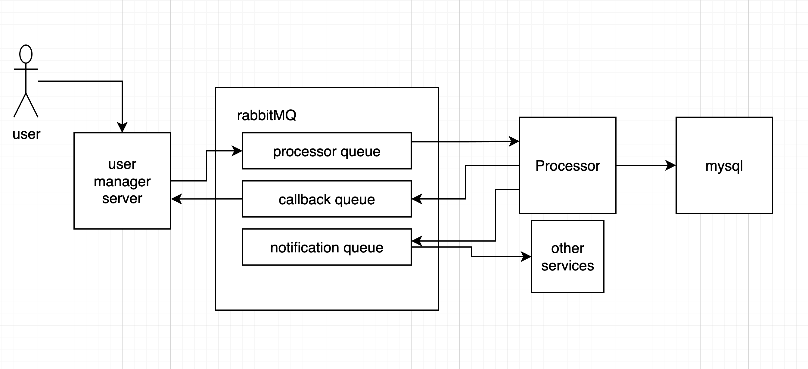

User manager
-

This small project implements a CRUD system for user management.

All options are reachable with the classical verbs (PUT, GET, DELETE, POST) at `/users` and `/users/{id}`

The get support different list options:
 - include.firstname to filter by firstname
 - include.country to filter by country
 - include.lastname to filter by lastname
 - page.number (page number, 1 is the first page)
 - page.rows (#rows per page)

All calls are 100% async with rabbitMq in the middle. Moreover, all calls, but the list user is fire and forget returning an 202 instead of a 200. 

The flow of a request is the following for PUT, DELETE and POST:

> "user-manager" -> "rabbit-mq (processor queue)" -> "processor" -> "mysql"

The flow of a request is the following for GET:

> "user-manager" -> "rabbit-mq (processor queue)" -> "processor" -> "mysql" -> "processor" -> "rabbit-mq (callback queue)" -> "user-manager"

The service could be scaled adding more user-managers or processors. 

On the top of that each time a resource is modified in the db a new message is sent in a notification queue

**Note** that `created_at` and `updated_at` are missing. 
It would have been "just more of the same" since it was already a lot of code I decided there was not a real need to add that.

**Note** tests should grow in number, due to time constrains I avoided completely to write tests for some packages

**Note** config is hardcoded for time constrain


Usage with dockerCompose
-
`make run` to run the whole solution

If you do not want to use the UI you can connect directly to the endpoint with `curl` or any other tool:
```bash
curl -X POST "http://[::]:35307/users" -H "accept: application/json" -H "Content-Type: application/json" -d "{ \"first_name\": \"paolo\", \"last_name\": \"gallina\", \"nickName\": \"gallocedrone\", \"password\": \"supersecurepassword\", \"email\": \"paologallina@gmail.com\", \"country\": \"Italy\", \"id\": \"f478e0c4-bc9c-11ec-8422-0242ac120002\"}"
curl -X GET "http://[::]:35307/users?include.firstname=paolo&page.number=1&page.rows=3" -H "accept: application/json"
curl -X GET "http://[::]:35307/users?include.firstname=notExisting" -H "accept: application/json"
curl -X PUT "http://[::]:35307/users/f478e0c4-bc9c-11ec-8422-0242ac120002" -H "accept: application/json" -H "Content-Type: application/json" -d "{ \"first_name\": \"paolo\", \"last_name\": \"gallina\", \"nickName\": \"gallocedrone\", \"password\": \"supersecurepassword\", \"email\": \"paologallina@gmail.com\", \"country\": \"Italy\", \"id\": \"f478e0c4-bc9c-11ec-8422-0242ac120002\"}"
curl -X DELETE "http://[::]:35307/users/f478e0c4-bc9c-11ec-8422-0242ac120002" -H "accept: application/json"
```

Run tests
-
`make e2e-test` to run the whole e2e suite

`make test` to run unit tests

Access RabbitMQ console
-

Navigate to `http://localhost:15672/` and inset `guest` and `guest` as user and passwords

Improvements needed performance/monitoring
-

 - each request should have an ID assigned and logs should include it in the formatted message
 - Metrics could be added as middleware with statistics
 - User could receive a more useful error message in the body
 - Most options should be configurable, currently it is not possible
 - Currently, there is one channel per operation it is a big overhead, and we should have a pool of channels or just one per consumer with golang channels in front of them (they are not thread safe) 